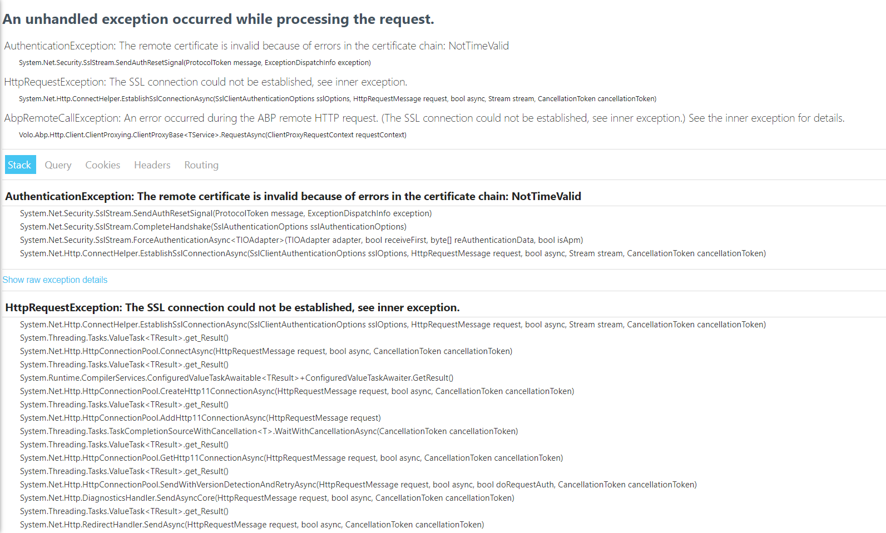

# MediaInAction

This is a reference project for those who want to build microservice solutions with the ABP Framework.

## Issues

Please open issues on the main GitHub repository: https://github.com/jpoconnell/MediaInAction/issues


### Requirements

- .NET 9.0 SDK
- Docker
- Yarn v1.20+(not v2) or npm v6+ (already installed with Node)

### Instructions

- Clone the repository ( [MediaInAction](https://github.com/jpoconnell/MediaInAction) )

- Rename `.env.example` file to `.env` file and provide PayPal ClientID and Secret.


- Wait until all applications are up!

	- You can check the running application from `tye` dashboard ([localhost:8000](http://127.0.0.1:8000/))
	- **Note**: If you see all of your applications keep restarting on `tye` dashboard or `tye` console, you may be facing SSL certificate issues. To diagnose the problems better, check any application logs. If it is related to SSL, developer certificate creation may have failed because of Powershell issues regarding authorization. Check the PowerShell script running configuration and set the policy for your local machine as follows: 
	```bash
	Get-ExecutionPolicy -list
	Set-ExecutionPolicy -ExecutionPolicy RemoteSigned -Scope LocalMachine
	```
	See [Microsoft Powershell documentation](https://docs.microsoft.com/en-us/powershell/module/microsoft.powershell.security/get-executionpolicy?view=powershell-7.2) for more information.

- After all your backend services are up, start the angular application:

  ```bash
  cd apps/angular
  yarn start
  ```

### Certificate Expiration
If the certificate is expired, you'll see the following error:

<!-- Make it smaller with 320px height  -->


Generating a new certificate will fix that issue. To generate a new one,

- Remove `etc/dev-cert/localhost.pfx`

- Manually execute `create-certificate.ps1` **or** re-run solution with `run-tye.ps1`


## Roadmap
### Version 1.0

- [x] New blank micro-service solution ✔️
- [x] Creating Deployment Scenarios ✔️
- [x] Creating empty business services ✔️
- [x] Implementing	 business logic into services ✔️
  - [x] Payment with PayPal ✔️
  - [x] Basket, Catalog, Order Service ✔️
- [x] Docker Image creation ✔️
- [x] Helm deployment for local k8s cluster ✔️
- [x] Switch Ocelot to <strike>Envoy</strike> YARP in Public Web gateway ✔️
- [x] Use gRPC for catalog microservice ✔️
- [x] Management Side of Services ✔️
- [x] Administration application (to manage products and orders with a dashboard) ✔️
- [x] Deployment to azure k8s ✔️ (https://eshoponabp.com)
### Version 2.0
- [x] Product-detail page on the shopping application (with CMS-kit integration for comments and rating components) ✔️
- [x] Switch to Keycloak from IdentityServer in AuthServer
- [ ] Re-design authorization/permission management
- [ ] Integrate a new sample microservice written in GoLang (Or Python / Java)
### Documentation

- [ ] We will create an e-book to explain the solution

## Current Architecture


## ABP Community Talks

We've organized a meetup related to this solution. You can watch it here: https://community.abp.io/events/microservice-development-iv7d46ov
